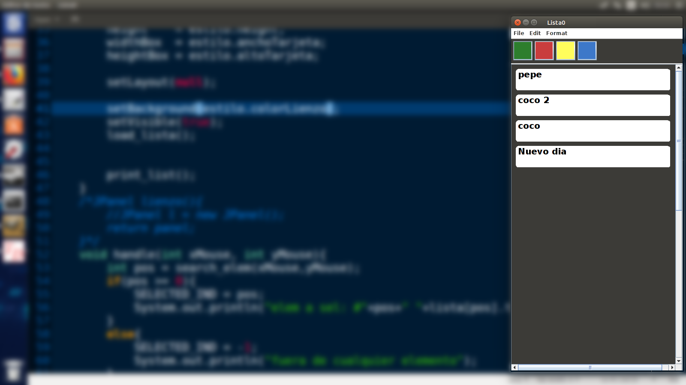

# TODO's list #

This is a simple todo list program, to create, edit and use todo lists

## How do I use it? ##

Try it downloading the '.jar' file in the 'Try' folder.

or

clone de proyect 

remove all the '.class' files (yes, i won't delete them for you! :P )

~~~
[Linux]$rm *.class    

$make

$java main
~~~

## by ##

***Brian A. Chacón***

## Conctacto ##

brian89.chacon89@gmail.com
